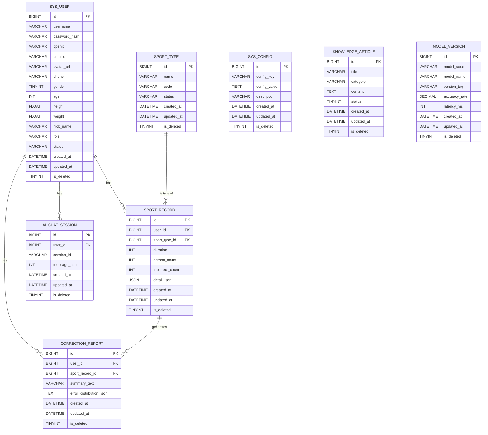

# 数据库逻辑结构 ER 图

```mermaid
erDiagram
    SYS_USER {
        BIGINT id PK
        VARCHAR username
        VARCHAR password_hash
        VARCHAR openid
        VARCHAR unionid
        VARCHAR avatar_url
        VARCHAR phone
        TINYINT gender
        INT age
        FLOAT height
        FLOAT weight
        VARCHAR nick_name
        VARCHAR role
        VARCHAR status
        DATETIME created_at
        DATETIME updated_at
        TINYINT is_deleted
    }

    SPORT_TYPE {
        BIGINT id PK
        VARCHAR name
        VARCHAR code
        VARCHAR status
        DATETIME created_at
        DATETIME updated_at
        TINYINT is_deleted
    }

    SPORT_RECORD {
        BIGINT id PK
        BIGINT user_id FK
        BIGINT sport_type_id FK
        INT duration
        INT correct_count
        INT incorrect_count
        JSON detail_json
        DATETIME created_at
        DATETIME updated_at
        TINYINT is_deleted
    }

    SYS_CONFIG {
        BIGINT id PK
        VARCHAR config_key
        TEXT config_value
        VARCHAR description
        DATETIME created_at
        DATETIME updated_at
        TINYINT is_deleted
    }

    AI_CHAT_SESSION {
        BIGINT id PK
        BIGINT user_id FK
        VARCHAR session_id
        INT message_count
        DATETIME created_at
        DATETIME updated_at
        TINYINT is_deleted
    }

    KNOWLEDGE_ARTICLE {
        BIGINT id PK
        VARCHAR title
        VARCHAR category
        TEXT content
        TINYINT status
        DATETIME created_at
        DATETIME updated_at
        TINYINT is_deleted
    }

    MODEL_VERSION {
        BIGINT id PK
        VARCHAR model_code
        VARCHAR model_name
        VARCHAR version_tag
        DECIMAL accuracy_rate
        INT latency_ms
        DATETIME created_at
        DATETIME updated_at
        TINYINT is_deleted
    }

    CORRECTION_REPORT {
        BIGINT id PK
        BIGINT user_id FK
        BIGINT sport_record_id FK
        VARCHAR summary_text
        TEXT error_distribution_json
        DATETIME created_at
        DATETIME updated_at
        TINYINT is_deleted
    }

    SYS_USER ||--o{ SPORT_RECORD : "has"
    SYS_USER ||--o{ AI_CHAT_SESSION : "has"
    SYS_USER ||--o{ CORRECTION_REPORT : "has"
    SPORT_TYPE ||--o{ SPORT_RECORD : "is type of"
    SPORT_RECORD ||--o{ CORRECTION_REPORT : "generates"
```