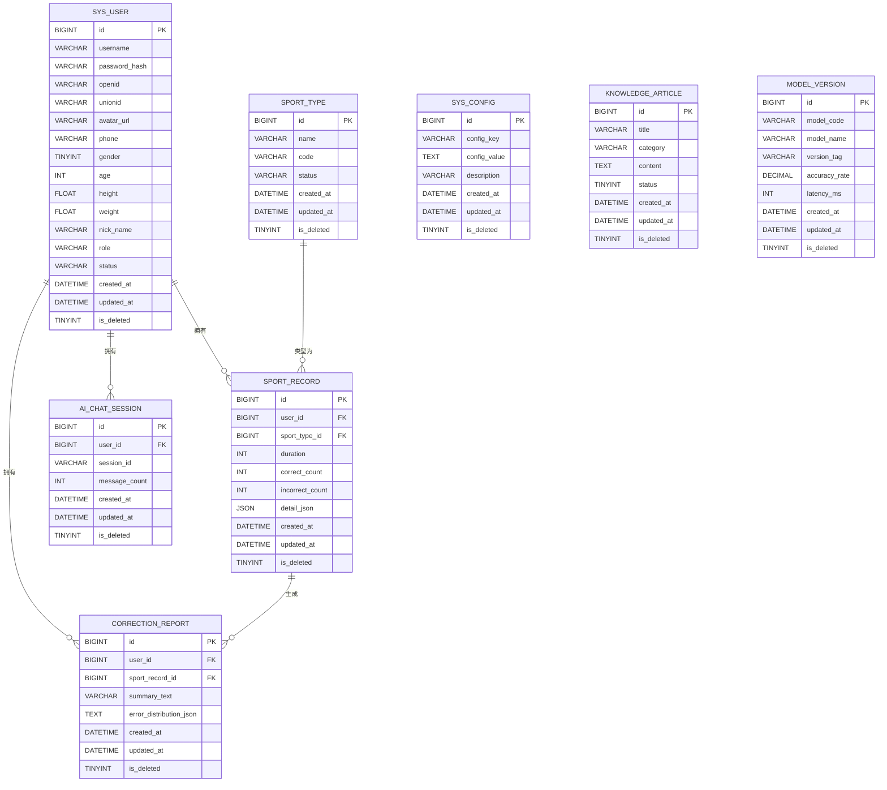

# 数据库设计结构

## 1. 物理结构

### 1.1 sys_user (用户表)

| 字段名 | 类型 | 长度 | 是否为空 | 默认值 | 中文含义 |
| :--- | :--- | :--- | :--- | :--- | :--- |
| id | BIGINT | 20 | NO | AUTO_INCREMENT | 主键ID |
| username | VARCHAR | 50 | NO | - | 用户名 |
| password_hash | VARCHAR | 255 | YES | - | 密码哈希值 |
| openid | VARCHAR | 64 | YES | - | 微信OpenID |
| unionid | VARCHAR | 64 | YES | - | 微信UnionID |
| avatar_url | VARCHAR | 255 | YES | - | 头像URL |
| phone | VARCHAR | 20 | YES | - | 手机号 |
| gender | TINYINT(1) | 1 | YES | 0 | 性别(0:未知, 1:男, 2:女) |
| age | INT | 3 | YES | - | 年龄 |
| height | FLOAT | - | YES | - | 身高(cm) |
| weight | FLOAT | - | YES | - | 体重(kg) |
| nick_name | VARCHAR | 64 | YES | - | 昵称 |
| role | VARCHAR | 20 | NO | 'user' | 角色(super, admin, user) |
| status | VARCHAR | 20 | NO | 'active' | 状态(active, inactive) |
| created_at | DATETIME | - | NO | CURRENT_TIMESTAMP | 创建时间 |
| updated_at | DATETIME | - | NO | CURRENT_TIMESTAMP | 更新时间 |
| is_deleted | TINYINT(1) | 1 | NO | 0 | 逻辑删除标记 |

### 1.2 sport_type (运动类型表)

| 字段名 | 类型 | 长度 | 是否为空 | 默认值 | 中文含义 |
| :--- | :--- | :--- | :--- | :--- | :--- |
| id | BIGINT | 20 | NO | AUTO_INCREMENT | 主键ID |
| name | VARCHAR | 50 | NO | - | 运动名称 |
| code | VARCHAR | 50 | NO | - | 运动代码 |
| status | VARCHAR | 20 | NO | 'active' | 状态 |
| created_at | DATETIME | - | NO | CURRENT_TIMESTAMP | 创建时间 |
| updated_at | DATETIME | - | NO | CURRENT_TIMESTAMP | 更新时间 |
| is_deleted | TINYINT(1) | 1 | NO | 0 | 逻辑删除标记 |

### 1.3 sport_record (运动记录表)

| 字段名 | 类型 | 长度 | 是否为空 | 默认值 | 中文含义 |
| :--- | :--- | :--- | :--- | :--- | :--- |
| id | BIGINT | 20 | NO | AUTO_INCREMENT | 主键ID |
| user_id | BIGINT | 20 | NO | - | 用户ID(外键关联sys_user.id) |
| sport_type_id | BIGINT | 20 | NO | - | 运动类型ID(外键关联sport_type.id) |
| duration | INT | - | NO | 0 | 运动时长(秒) |
| correct_count | INT | - | NO | 0 | 正确次数 |
| incorrect_count | INT | - | NO | 0 | 错误次数 |
| detail_json | JSON | - | YES | - | 详细数据(骨架点/角度等) |
| created_at | DATETIME | - | NO | CURRENT_TIMESTAMP | 创建时间 |
| updated_at | DATETIME | - | NO | CURRENT_TIMESTAMP | 更新时间 |
| is_deleted | TINYINT(1) | 1 | NO | 0 | 逻辑删除标记 |

### 1.4 sys_config (系统配置表)

| 字段名 | 类型 | 长度 | 是否为空 | 默认值 | 中文含义 |
| :--- | :--- | :--- | :--- | :--- | :--- |
| id | BIGINT | 20 | NO | AUTO_INCREMENT | 主键ID |
| config_key | VARCHAR | 50 | NO | - | 配置键名 |
| config_value | TEXT | - | YES | - | 配置值 |
| description | VARCHAR | 255 | YES | - | 描述 |
| created_at | DATETIME | - | NO | CURRENT_TIMESTAMP | 创建时间 |
| updated_at | DATETIME | - | NO | CURRENT_TIMESTAMP | 更新时间 |
| is_deleted | TINYINT(1) | 1 | NO | 0 | 逻辑删除标记 |

### 1.5 ai_chat_session (AI会话表)

| 字段名 | 类型 | 长度 | 是否为空 | 默认值 | 中文含义 |
| :--- | :--- | :--- | :--- | :--- | :--- |
| id | BIGINT | 20 | NO | AUTO_INCREMENT | 主键ID |
| user_id | BIGINT | 20 | NO | - | 用户ID(外键关联sys_user.id) |
| session_id | VARCHAR | 64 | NO | - | 会话标识 |
| message_count | INT | - | NO | - | 消息数量 |
| created_at | DATETIME | - | NO | CURRENT_TIMESTAMP | 创建时间 |
| updated_at | DATETIME | - | NO | CURRENT_TIMESTAMP | 更新时间 |
| is_deleted | TINYINT(1) | 1 | NO | 0 | 逻辑删除标记 |

### 1.6 knowledge_article (运动知识表)

| 字段名 | 类型 | 长度 | 是否为空 | 默认值 | 中文含义 |
| :--- | :--- | :--- | :--- | :--- | :--- |
| id | BIGINT | 20 | NO | AUTO_INCREMENT | 主键ID |
| title | VARCHAR | 128 | NO | - | 标题 |
| category | VARCHAR | 64 | NO | - | 分类 |
| content | TEXT | - | NO | - | 内容 |
| status | TINYINT | 1 | NO | - | 状态 |
| created_at | DATETIME | - | NO | CURRENT_TIMESTAMP | 创建时间 |
| updated_at | DATETIME | - | NO | CURRENT_TIMESTAMP | 更新时间 |
| is_deleted | TINYINT(1) | 1 | NO | 0 | 逻辑删除标记 |

### 1.7 model_version (模型版本表)

| 字段名 | 类型 | 长度 | 是否为空 | 默认值 | 中文含义 |
| :--- | :--- | :--- | :--- | :--- | :--- |
| id | BIGINT | 20 | NO | AUTO_INCREMENT | 主键ID |
| model_code | VARCHAR | 64 | NO | - | 模型代码 |
| model_name | VARCHAR | 64 | NO | - | 模型名称 |
| version_tag | VARCHAR | 32 | NO | - | 版本标签 |
| accuracy_rate | DECIMAL(5,2) | 5 | NO | - | 准确率 |
| latency_ms | INT | - | NO | - | 延迟(ms) |
| created_at | DATETIME | - | NO | CURRENT_TIMESTAMP | 创建时间 |
| updated_at | DATETIME | - | NO | CURRENT_TIMESTAMP | 更新时间 |
| is_deleted | TINYINT(1) | 1 | NO | 0 | 逻辑删除标记 |

### 1.8 correction_report (矫正报告表)

| 字段名 | 类型 | 长度 | 是否为空 | 默认值 | 中文含义 |
| :--- | :--- | :--- | :--- | :--- | :--- |
| id | BIGINT | 20 | NO | AUTO_INCREMENT | 主键ID |
| user_id | BIGINT | 20 | NO | - | 用户ID(外键关联sys_user.id) |
| sport_record_id | BIGINT | 20 | NO | - | 运动记录ID(外键关联sport_record.id) |
| summary_text | VARCHAR | 512 | NO | - | 总结文本 |
| error_distribution_json | TEXT | - | YES | - | 错误分布数据 |
| created_at | DATETIME | - | NO | CURRENT_TIMESTAMP | 创建时间 |
| updated_at | DATETIME | - | NO | CURRENT_TIMESTAMP | 更新时间 |
| is_deleted | TINYINT(1) | 1 | NO | 0 | 逻辑删除标记 |

## 2. 逻辑结构（E-R图）

