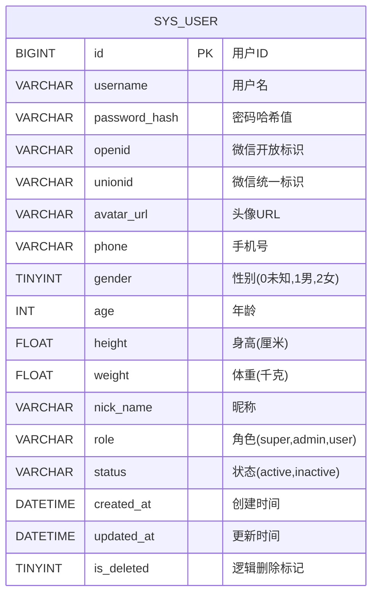
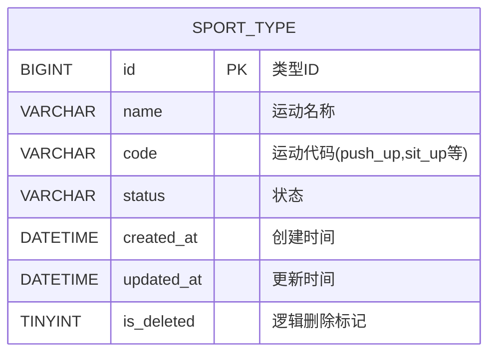
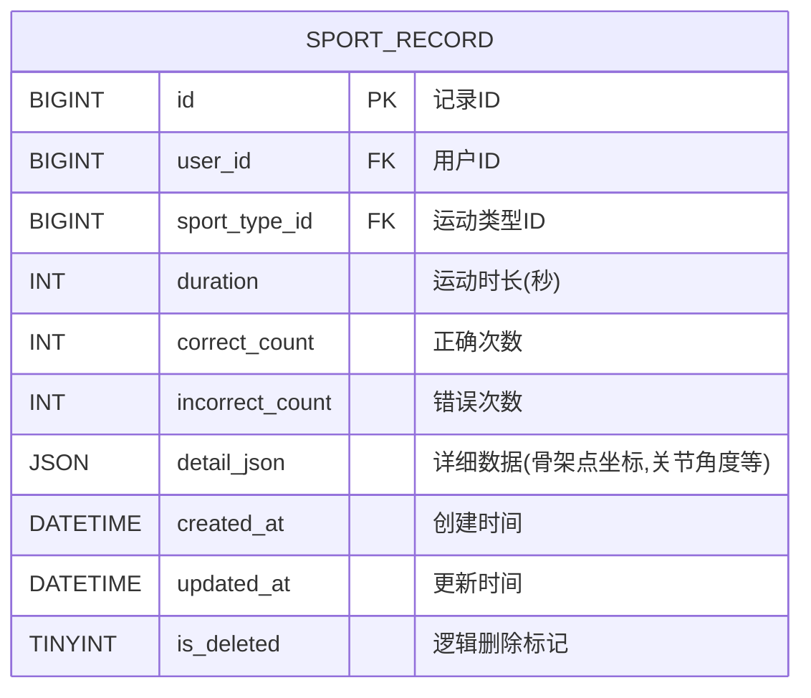
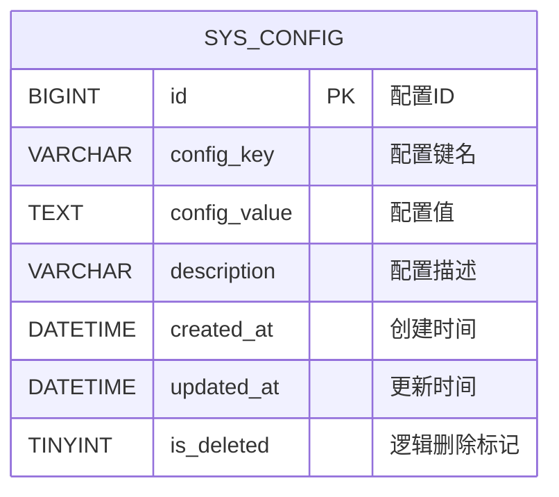
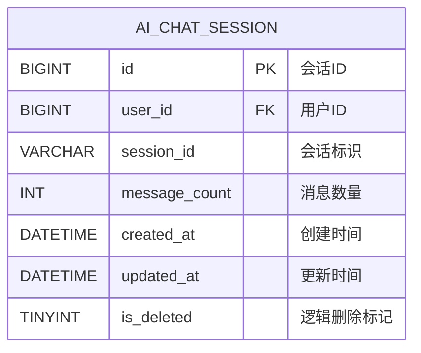
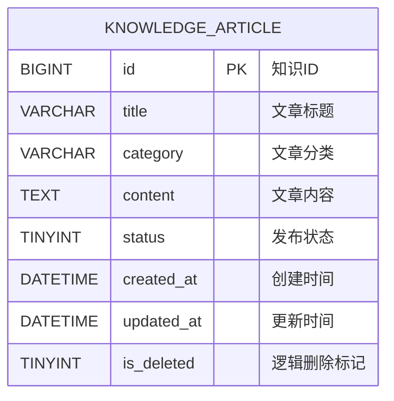
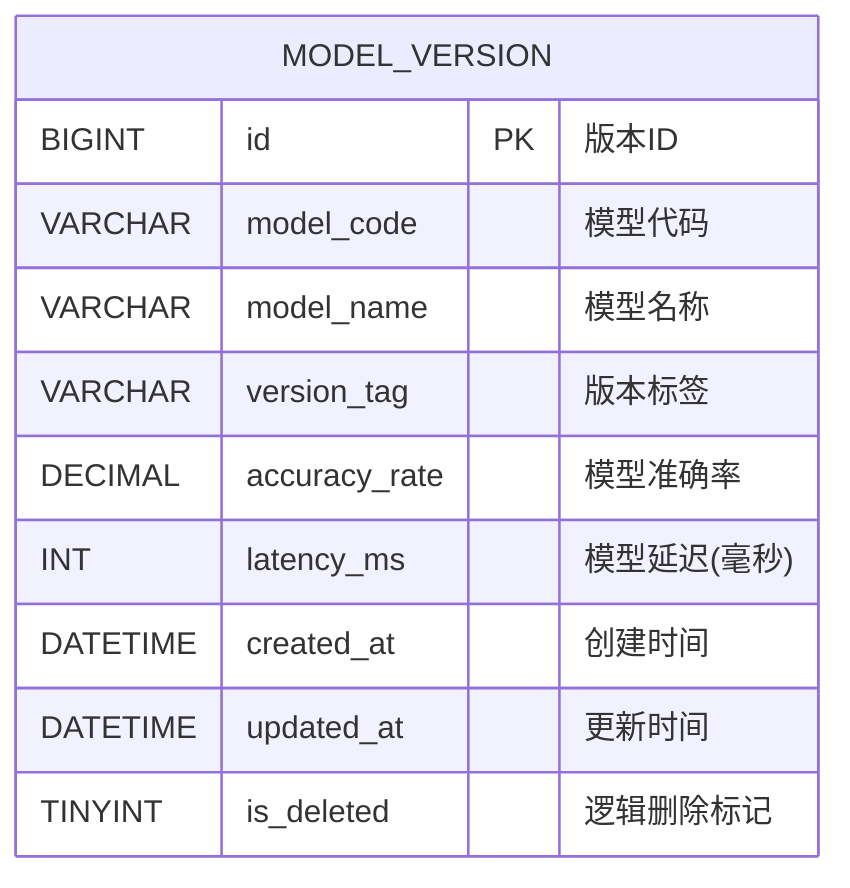
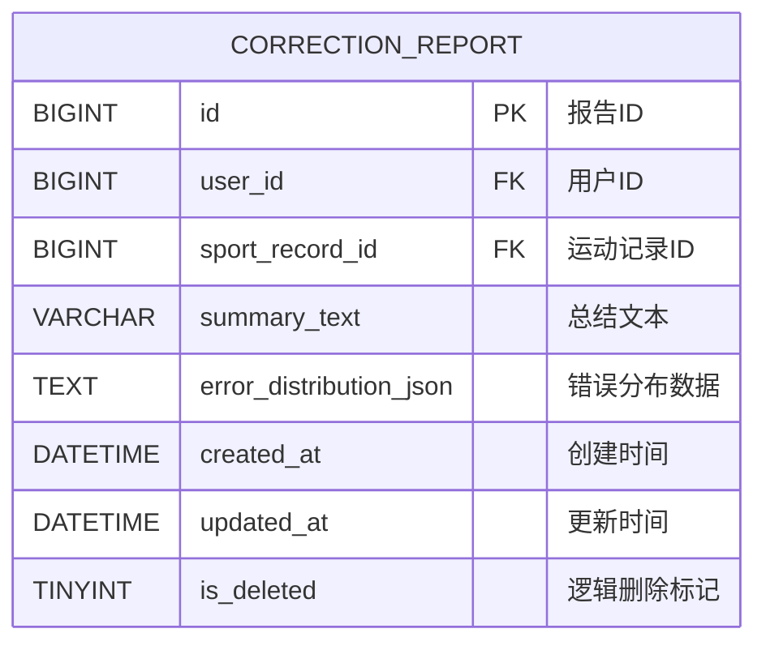
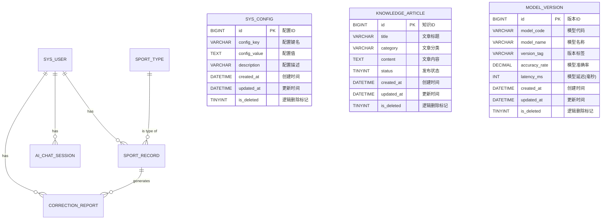

# 数据库表结构详细图

## 1. 表结构单独图

### 1.1 sys_user (用户表)

### 1.2 sport_type (运动类型表)

### 1.3 sport_record (运动记录表)

### 1.4 sys_config (系统配置表)

### 1.5 ai_chat_session (AI会话表)

### 1.6 knowledge_article (运动知识表)

### 1.7 model_version (模型版本表)

### 1.8 correction_report (矫正报告表)

## 2. 表关系图

