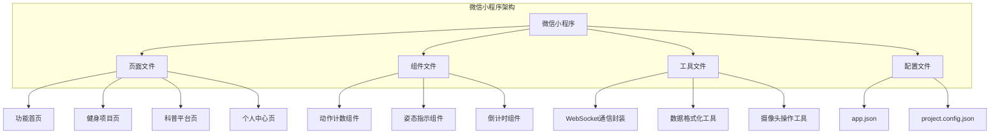
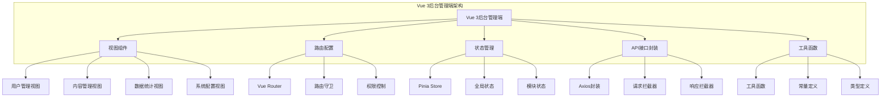
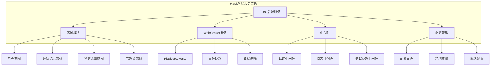
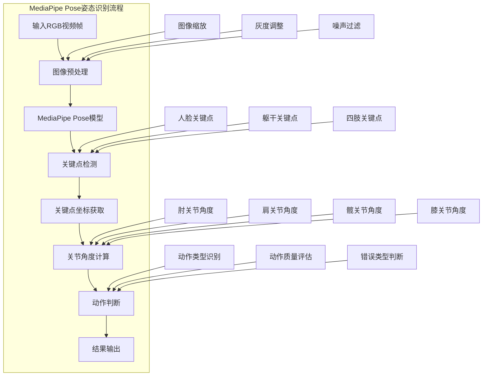
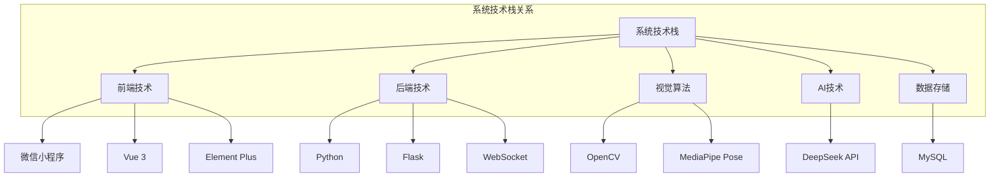

# 2. 系统相关技术

本章主要介绍运动动作矫正系统开发过程中所采用的关键技术，包括前端开发技术、后端服务技术、视觉算法、人工智能技术以及数据存储技术。这些技术的合理选型与有效整合，为系统的高效运行和功能实现提供了坚实的技术保障。

## 2.1 前端技术

本系统的前端开发分为面向普通用户的微信小程序端和面向管理人员的后台管理端两个部分，分别采用不同的技术方案以满足差异化的使用场景和功能需求。

微信小程序是一种不需要下载安装即可使用的应用，用户通过微信扫描二维码或搜索小程序名称即可快速访问系统功能。微信小程序采用WXML、WXSS和JavaScript作为主要开发语言，具有轻量级、启动快速、跨平台等特点。在本系统中，微信小程序端主要负责健身动作的实时采集与展示，通过调用微信提供的摄像头API获取用户运动视频流，并利用WebSocket技术与服务器端建立持久连接，实现健身数据的实时传输与矫正结果的即时反馈。微信小程序的轻量化特性使其能够在配置较低的移动设备上流畅运行，有效降低了用户的使用门槛，满足了用户随时随地进行健身锻炼的需求。

后台管理端采用Vue 3框架结合Element Plus组件库进行开发。Vue 3是新一代渐进式JavaScript框架，相比Vue 2版本，在性能、体积和开发体验等方面均有显著提升。Vue 3引入了Composition API，使得代码逻辑更加清晰、复用性更强，便于大型项目的维护和扩展。Element Plus是基于Vue 3的企业级UI组件库，提供了丰富的预设组件，如表格、表单、对话框、按钮等，能够快速构建美观、交互友好的管理界面。在本系统中，后台管理端主要实现用户管理、健身数据统计、系统配置等功能，为管理员提供直观的数据可视化展示和便捷的操作界面。

前后端分离的架构设计使得前端开发与后端开发可以并行进行，提高了开发效率。前端通过HTTP协议和WebSocket协议与后端进行数据交互，接口设计遵循RESTful规范，保证了系统的可维护性和可扩展性。

## 2.2 后端技术

本系统的后端服务采用Python语言结合Flask框架进行开发，承担着业务逻辑处理、数据转发和算法调度等核心职责。

Python是一种高级编程语言，以其简洁优雅的语法和丰富的第三方库生态而著称。在人工智能、数据分析和Web开发等领域，Python已成为主流的开发语言之一。Python的动态类型特性和解释执行机制使其开发效率较高，适合快速原型开发和迭代优化。本系统选用Python作为后端开发语言，一方面得益于其在机器学习和计算机视觉领域的广泛应用，便于与MediaPipe等视觉算法库进行集成；另一方面，Python丰富的Web框架生态为系统开发提供了多样化的选择。

Flask是一个轻量级的Python Web框架，采用Werkzeug作为WSGI工具箱，使用Jinja2作为模板引擎。Flask的设计理念是保持核心简洁，同时通过扩展机制提供丰富的功能支持。与Django等全功能框架相比，Flask更加灵活，开发者可以根据项目需求自由选择组件，避免了不必要的功能冗余。本系统主要利用Flask的路由处理和请求处理功能，通过定义不同的路由端点来区分和处理各类健身动作识别请求。Flask的蓝图机制使得项目结构更加清晰，便于按功能模块进行代码组织和管理。

在数据通信方面，系统采用WebSocket协议实现微信小程序与服务器之间的实时双向通信。WebSocket是一种在单个TCP连接上进行全双工通信的协议，相比传统的HTTP请求-响应模式，WebSocket能够显著降低通信延迟，减少网络开销。服务器端通过Flask-SocketIO扩展实现WebSocket服务，监听来自客户端的健身图像数据，并将姿态识别结果实时推送至客户端。这种实时通信机制保证了健身动作矫正的即时性，提升了用户体验。

## 2.3 视觉算法

视觉算法是本系统的核心技术组成部分，主要实现人体姿态检测与健身动作识别功能。系统采用OpenCV进行图像预处理，结合MediaPipe Pose算法实现精准的人体姿态估计。

OpenCV是一个开源的计算机视觉库，提供了丰富的图像处理和计算机视觉算法实现。OpenCV支持多种编程语言接口，包括Python、C++和Java等，具有跨平台、高性能的特点。在本系统中，OpenCV主要用于图像数据的形态学预处理，包括图像缩放、灰度调整和噪声过滤等操作。微信小程序采集的原始图像分辨率较高，直接输入姿态估计模型会增加计算开销。系统通过OpenCV将原始图像缩放至适合模型输入的尺寸，同时采用自适应灰度增强技术处理不同光照条件下的图像，提高了姿态识别算法在各种环境下的鲁棒性。

MediaPipe Pose是由Google开发的高保真人体姿态跟踪解决方案，基于BlazePose研究成果构建。MediaPipe Pose能够从RGB视频帧中实时检测人体33个二维关键点，覆盖面部、躯干和四肢等主要身体部位。该算法采用编码器-解码器网络架构进行关键点热图预测，并通过梯度停止连接技术实现模型轻量化，使其能够在资源受限的设备上实现实时检测。本系统利用MediaPipe Pose算法检测健身运动中的人体关键点，通过计算关节角度判断动作的规范性。以俯卧撑动作为例，系统选取肩部、肘部和髋部等关键点，计算肘关节角度、肩部角度和髋关节角度，根据角度变化判断动作是否标准。对于仰卧起坐动作，系统通过检测髋关节角度和膝关节弯曲角度，判断用户的动作完成情况。这种基于关键点角度分析的方法具有较高的识别准确率和良好的实时性能。

## 2.4 AI 技术

本系统在健身动作矫正功能中引入人工智能技术，通过大语言模型为用户提供智能化的健身指导和动作分析服务。系统采用DeepSeek API作为AI能力支撑，实现健身知识的智能问答和动作建议的个性化生成。

DeepSeek是一款国产大语言模型，具备强大的自然语言理解和生成能力。该模型在中文语境下表现优异，能够准确理解用户的健身相关问题，并生成专业、流畅的回答内容。通过调用DeepSeek API，系统无需在本地部署大规模语言模型，降低了硬件资源需求，同时能够持续获得模型迭代升级带来的性能提升。在系统实现中，当用户完成健身动作后，系统将动作识别结果和用户健身数据发送至DeepSeek API，由模型生成针对性的动作改进建议和训练计划推荐。

AI技术在系统中的应用主要体现在以下方面：一是健身知识科普，用户可以通过系统查询各类健身动作的标准姿势、注意事项和训练效果，AI模型根据用户问题生成详细的解答内容；二是动作分析报告，系统将用户的健身数据转化为自然语言描述，AI模型据此生成个性化的训练建议；三是智能交互，用户可以与系统进行自然语言对话，获取健身指导和训练规划。AI技术的引入使得系统从单纯的动作检测工具升级为智能健身助手，提升了用户的使用体验和健身效果。

## 2.5 数据存储

数据存储是系统运行的重要基础，本系统采用MySQL关系型数据库作为主要的数据存储方案，实现用户信息、健身记录和系统配置等数据的持久化管理。

MySQL是一款开源的关系型数据库管理系统，以其稳定可靠、性能优异和易于使用等特点，成为Web应用开发中最流行的数据库之一。MySQL支持标准的SQL语言，提供了完善的事务处理、索引优化和查询缓存机制，能够满足中小型应用的数据存储需求。本系统采用MySQL 8.0版本，该版本在性能、安全性和功能特性方面均有显著增强，支持JSON数据类型、窗口函数和公共表表达式等高级特性。

在数据库设计方面，系统根据业务需求设计了多个数据表，主要包括用户表、健身记录表和系统配置表等。用户表存储用户的基本信息，包括用户标识、昵称、头像、身高体重等属性；健身记录表记录用户的每次健身数据，包括运动类型、运动时长、动作完成数量和错误类型统计等信息。数据库表之间通过外键关联，保证数据的完整性和一致性。系统采用ORM技术实现Python对象与数据库表的映射，简化了数据访问层的开发工作。同时，系统对敏感数据如用户密码进行加密存储，保障用户信息安全。

## 2.6 本章小结

本章系统介绍了运动动作矫正系统开发所采用的关键技术。前端技术方面，微信小程序为普通用户提供了便捷的移动端访问入口，Vue 3结合Element Plus构建了功能完善的后台管理界面。后端技术方面，Python语言配合Flask框架实现了轻量高效的Web服务，WebSocket协议保障了前后端的实时通信。视觉算法方面，OpenCV完成图像预处理工作，MediaPipe Pose算法实现了高精度的人体姿态检测。AI技术方面，DeepSeek API为系统提供了智能化的健身指导能力。数据存储方面，MySQL数据库实现了系统数据的可靠存储和高效查询。上述技术的有机结合，为系统的功能实现和稳定运行奠定了坚实基础。

