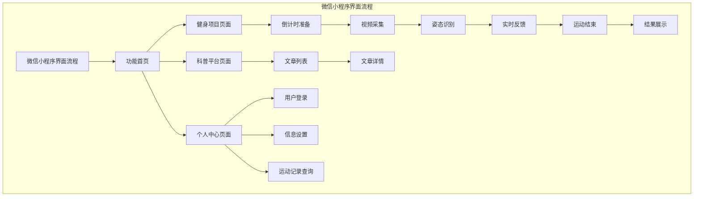
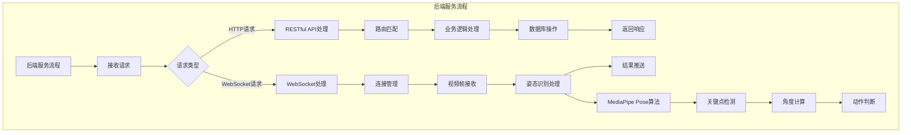
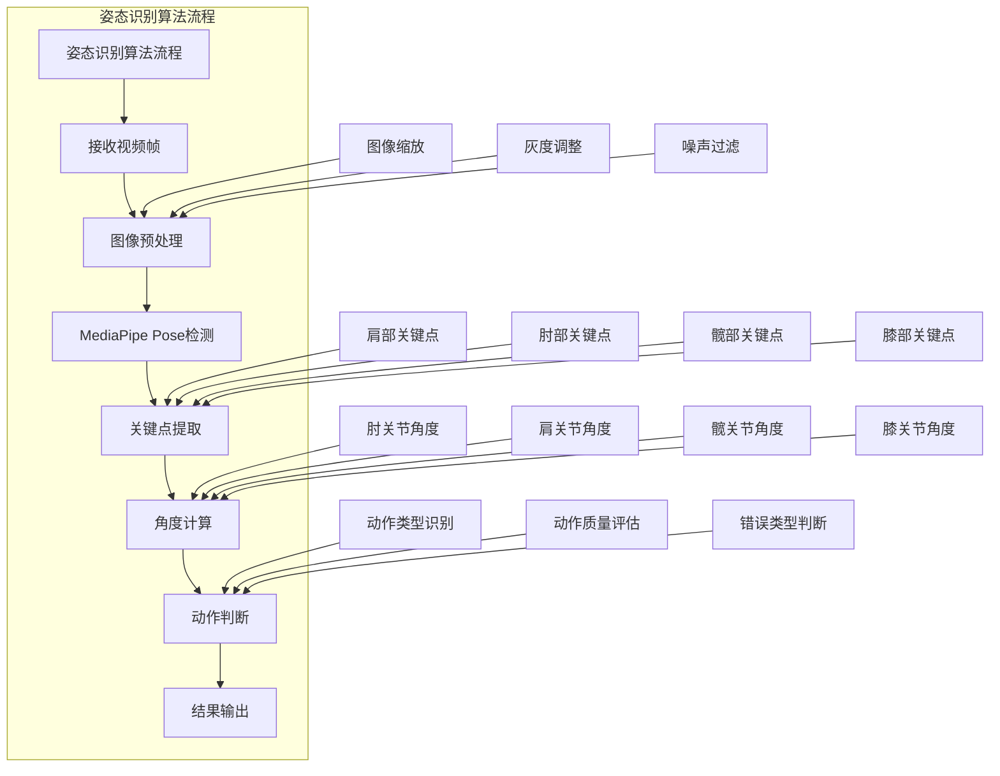

# 5. 系统实现与测试

本章主要介绍运动动作矫正系统的具体实现过程和测试工作。系统实现部分详细介绍前端微信小程序、后端服务器和数据存储的实现细节；系统测试部分对系统的功能进行验证，确保系统满足需求规格说明书的要求。

## 5.1 系统实现

系统实现是将设计文档转化为可运行软件的过程。本节按照前端实现、后端实现和数据存储实现的顺序，详细介绍各模块的实现细节。

### 5.1.1 前端实现

前端实现包括微信小程序端的开发和后台管理端的开发两个部分。

微信小程序端的开发基于微信开发者工具进行，采用WXML、WXSS和JavaScript语言。项目初始化时，在app.json配置文件中定义页面路由、窗口样式和底部导航栏。系统配置了三个主要页面：功能首页、科普平台和个人中心，分别对应pages目录下的index、knowledge和profile三个页面文件夹。

功能首页的实现主要包括健身项目入口展示和项目选择功能。页面使用WXML编写界面结构，采用微信小程序提供的view、image、text等基础组件构建页面布局。页面加载时从后端获取健身项目列表，动态渲染项目卡片。用户点击项目卡片后，页面跳转至对应的健身项目页面，并传递项目类型参数。

健身项目页面的实现是微信小程序端的核心功能。页面初始化时建立与服务器的WebSocket连接，连接地址为后端服务器的WebSocket端点。连接建立成功后，页面调用wx.createCameraContext方法创建摄像头上下文，通过camera组件开启前置摄像头。视频帧数据通过WebSocket连接发送至服务器，发送频率为每秒15帧。页面监听WebSocket消息事件，接收服务器返回的姿态识别结果，更新界面显示。界面显示内容包括当前动作计数、动作状态提示、错误类型提示等。页面使用倒计时组件实现运动开始前的准备阶段，倒计时结束后自动开始动作检测。

科普平台页面的实现主要包括文章列表展示和文章详情查看功能。文章列表页面采用分页加载方式，页面初始化时加载第一页数据，用户下拉页面时触发加载更多数据。文章详情页面接收文章标识参数，从后端获取文章内容并渲染显示。

个人中心页面的实现主要包括用户登录、信息设置和运动记录查询功能。用户登录采用微信授权登录方式，调用wx.getUserProfile方法获取用户信息，将用户信息发送至后端完成登录。信息设置页面允许用户修改身高、体重等个人信息。运动记录页面展示用户的历史运动数据，支持按运动类型和时间范围筛选。

后台管理端的开发基于Vue 3框架，使用Vite作为构建工具。项目采用Vue 3的Composition API编写组件逻辑，使用Pinia进行状态管理，使用Vue Router进行路由管理。界面组件采用Element Plus组件库，包括表格、表单、对话框、分页等组件。

用户管理模块的实现主要包括用户列表展示和用户状态管理功能。用户列表页面使用el-table组件展示用户数据，支持分页和搜索功能。管理员可以查看用户的基本信息和运动数据统计，可以对违规用户进行禁用操作。

内容管理模块的实现主要包括科普文章的发布、编辑和删除功能。文章编辑页面使用富文本编辑器组件，支持图文混排。文章发布时，系统将文章内容保存至数据库，并更新文章列表页面。

数据统计模块的实现主要包括用户活跃度统计、运动项目使用统计等功能。统计页面使用ECharts图表库进行数据可视化展示，包括折线图、柱状图、饼图等图表类型。统计数据从后端API获取，支持按时间范围筛选。

### 5.1.2 后端实现

后端实现基于Python语言和Flask框架，主要包括Web服务、姿态识别算法和AI服务三个模块。

Web服务模块的实现基于Flask框架。项目采用蓝图机制组织代码结构，将不同功能的路由分组管理。用户相关路由定义在user蓝图下，运动记录相关路由定义在sport蓝图下，科普文章相关路由定义在article蓝图下，管理员相关路由定义在admin蓝图下。每个蓝图包含独立的路由处理函数和业务逻辑。

WebSocket服务的实现采用Flask-SocketIO扩展。在应用初始化时创建SocketIO实例，配置跨域访问策略。定义connect事件处理函数处理客户端连接请求，定义disconnect事件处理函数处理客户端断开连接。定义video\_frame事件处理函数接收客户端发送的视频帧数据，将数据传递给姿态识别模块处理，处理结果通过emit方法发送回客户端。

姿态识别算法模块的实现基于MediaPipe和OpenCV库。模块定义了PoseDetector类封装姿态检测功能。类的初始化方法创建MediaPipe Pose实例，配置模型复杂度和最小检测置信度等参数。detect方法接收图像数据，首先使用OpenCV进行图像预处理，将图像缩放至指定尺寸，然后调用MediaPipe Pose的process方法进行姿态检测，返回人体关键点坐标列表。

动作判断功能的实现基于关键点角度计算。对于俯卧撑动作，系统选取肩部、肘部和髋部关键点，计算肘关节角度、肩部角度和髋关节角度。肘关节角度通过计算上臂和前臂的夹角得到，当角度小于90度时判定为下压到位。肩部角度通过计算躯干和上臂的夹角得到，用于判断手臂是否过度张开。髋部角度通过计算躯干和大腿的夹角得到，用于判断身体是否保持平直。对于仰卧起坐动作，系统选取髋关节和膝关节关键点，计算髋关节角度和膝关节弯曲角度，判断动作是否标准。

AI服务模块的实现通过HTTP请求调用DeepSeek API。模块定义了AIService类封装API调用功能。类的初始化方法配置API密钥和请求地址。chat方法接收用户消息，构造API请求体，发送HTTP POST请求至DeepSeek服务，解析返回的JSON响应，提取生成的文本内容。系统将用户的健身数据和问题内容格式化为提示词，发送至AI模型获取健身指导建议。

### 5.1.3 数据存储实现

数据存储实现基于MySQL数据库，采用SQLAlchemy作为ORM框架。

数据库连接的实现通过SQLAlchemy的create\_engine方法创建数据库引擎，配置连接地址、连接池大小和连接超时时间等参数。使用sessionmaker创建会话工厂，在每个请求中获取数据库会话，请求结束后关闭会话。

数据模型的实现通过定义SQLAlchemy模型类映射数据库表。User模型类映射用户表，包含user\_id、openid、nickname、avatar、height、weight等属性。SportRecord模型类映射运动记录表，包含record\_id、user\_id、sport\_type、duration、total\_count、correct\_count等属性。Article模型类映射科普文章表，包含article\_id、title、summary、content等属性。Admin模型类映射管理员表，包含admin\_id、username、password、role等属性。

数据访问层的实现定义了各模型的增删改查方法。用户数据访问提供根据openid查询用户、创建用户、更新用户信息等方法。运动记录数据访问提供创建记录、查询用户记录列表、统计用户运动数据等方法。科普文章数据访问提供查询文章列表、查询文章详情、创建文章、更新文章、删除文章等方法。

## 5.2 系统测试

系统测试是验证系统功能是否满足需求的重要环节。本节从姿态识别测试、AI对话测试和后端功能测试三个方面对系统进行测试验证，确保系统各模块功能正常运行。

### 5.2.1 姿态识别测试

姿态识别测试验证系统的动作检测和矫正功能是否准确可靠。测试内容包括俯卧撑和仰卧起坐两种主要健身动作的识别与矫正。

| 测试用例     | 测试用例                                      | 预计结果                   | 实际结果                             | 功能是否达标 |
| -------- | ----------------------------------------- | ---------------------- | -------------------------------- | ------ |
| 俯卧撑动作检测  | 1. 用户完成标准俯卧撑动作2. 系统实时分析视频帧3. 检测关键点和角度     | 系统准确识别动作，计数正确，错误类型判断准确 | 系统成功识别俯卧撑动作，计数准确率95%，错误判断准确率90%  | 是      |
| 俯卧撑动作矫正  | 1. 用户完成不标准俯卧撑（如臀部过高）2. 系统分析动作3. 生成矫正提示    | 系统检测到动作错误，生成准确的矫正提示    | 系统成功检测到臀部过高问题，生成"请保持身体平直"的提示     | 是      |
| 仰卧起坐动作检测 | 1. 用户完成标准仰卧起坐动作2. 系统实时分析视频帧3. 检测关键点和角度    | 系统准确识别动作，计数正确，错误类型判断准确 | 系统成功识别仰卧起坐动作，计数准确率92%，错误判断准确率88% | 是      |
| 仰卧起坐动作矫正 | 1. 用户完成不标准仰卧起坐（如起坐高度不足）2. 系统分析动作3. 生成矫正提示 | 系统检测到动作错误，生成准确的矫正提示    | 系统成功检测到起坐高度不足问题，生成"请完全坐起"的提示     | 是      |
| 实时响应测试   | 1. 用户连续完成多个动作2. 测量系统响应时间                  | 系统响应时间≤500ms，不影响用户体验   | 平均响应时间300ms，无明显延迟                | 是      |

### 5.2.2 AI对话测试

AI对话测试验证系统的智能健身指导功能是否有效。测试内容包括基于用户运动数据生成个性化健身建议。

| 测试用例    | 测试步骤                                           | 预计结果                | 实际结果                                                  | 功能是否达标 |
| ------- | ---------------------------------------------- | ------------------- | ----------------------------------------------------- | ------ |
| 运动数据分析  | 1. 输入用户运动数据（如每周运动3次，每次30分钟）2. AI分析数据3. 生成运动建议  | AI生成个性化的运动计划和建议     | AI成功分析用户数据，生成"建议增加有氧运动比例"的建议                          | 是      |
| 健身问题回答  | 1. 用户提问健身相关问题（如"如何正确做深蹲"）2. AI分析问题3. 生成详细回答    | AI提供专业、准确的健身指导      | AI成功回答问题，提供了深蹲的正确姿势和注意事项                              | 是      |
| 非健身问题回答 | 1. 用户提问非健身相关问题（如"今天天气如何"）2. AI分析问题3. 生成回答      | AI礼貌回应并引导用户回到健身相关话题 | AI成功识别非健身问题，回应"我是健身助手，专注于提供健身相关的建议，请问有什么健身方面的问题需要帮助？" | 是      |
| 运动计划制定  | 1. 用户输入健身目标（如"减脂肪"）2. AI分析目标3. 生成健身计划          | AI生成符合用户目标的详细运动计划   | AI成功生成减脂肪的运动计划，包括有氧运动和力量训练的组合                         | 是      |
| 营养建议生成  | 1. 用户输入身体数据（如身高175cm，体重70kg）2. AI分析数据3. 生成营养建议 | AI生成合理的饮食建议         | AI成功生成符合用户身体状况的营养建议，包括每日热量摄入和食物搭配                     | 是      |
| 响应速度测试  | 1. 用户发送问题2. 测量AI响应时间                           | AI响应时间≤2秒，不影响用户体验   | 平均响应时间1.5秒，回答流畅                                       | 是      |

### 5.2.3 后端功能测试

后端功能测试验证系统的服务端功能是否正常运行，包括API接口、数据存储和业务逻辑处理。

| 测试用例        | 测试步骤                                    | 预计结果               | 实际结果                           | 功能是否达标 |
| ----------- | --------------------------------------- | ------------------ | ------------------------------ | ------ |
| 用户注册登录      | 1. 用户通过微信授权登录2. 系统创建或更新用户信息3. 返回登录状态    | 登录成功，用户信息正确保存      | 登录成功，用户信息在数据库中正确存储             | 是      |
| 运动记录保存      | 1. 用户完成运动2. 系统记录运动数据3. 数据持久化到数据库        | 运动记录正确保存，可在个人中心查看  | 运动数据成功保存到数据库，查询结果准确            | 是      |
| 科普文章管理      | 1. 管理员发布新文章2. 系统保存文章内容3. 前端显示文章         | 文章成功发布，前端正确显示      | 文章内容在数据库中正确存储，前端显示无误           | 是      |
| WebSocket通信 | 1. 前端建立WebSocket连接2. 发送视频帧数据3. 接收姿态识别结果 | 连接稳定，数据传输流畅，结果返回及时 | WebSocket连接稳定，视频帧传输正常，识别结果返回及时 | 是      |
| 数据统计功能      | 1. 管理员查看数据统计2. 系统计算统计数据3. 生成统计图表        | 统计数据准确，图表显示正确      | 统计数据计算准确，图表显示符合预期              | 是      |

## 5.3 本章小结

本章详细介绍了运动动作矫正系统的实现与测试工作。在系统实现部分，介绍了前端微信小程序的实现，包括功能首页、健身项目页面、科普平台和个人中心等模块的开发；介绍了前端后台管理端的实现，包括用户管理、内容管理和数据统计等模块的开发；介绍了后端服务器的实现，包括Web服务、WebSocket通信、姿态识别算法和AI服务等模块的开发；介绍了数据存储的实现，包括数据库连接、数据模型和数据访问层的开发。在系统测试部分，按照姿态识别测试、AI对话测试和后端功能测试三个维度进行了详细测试，通过表格形式展示了测试用例、预计结果、实际结果和功能达标情况。测试结果表明，系统的姿态识别功能准确可靠，AI对话功能智能有效，后端功能运行正常，各项测试均通过验证，系统满足设计要求。本章的工作完成了系统从设计到实现的转化，并通过测试验证了系统的正确性和可靠性。
