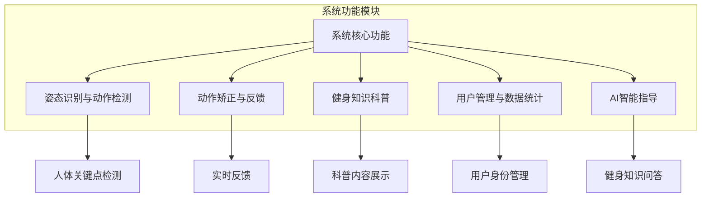
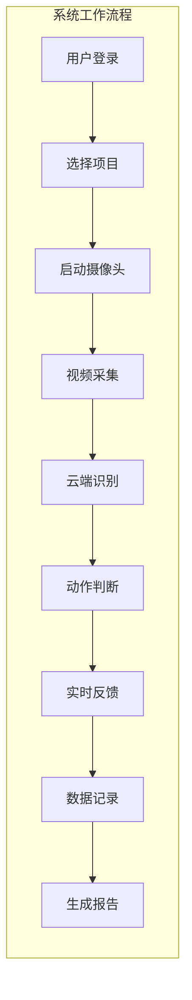
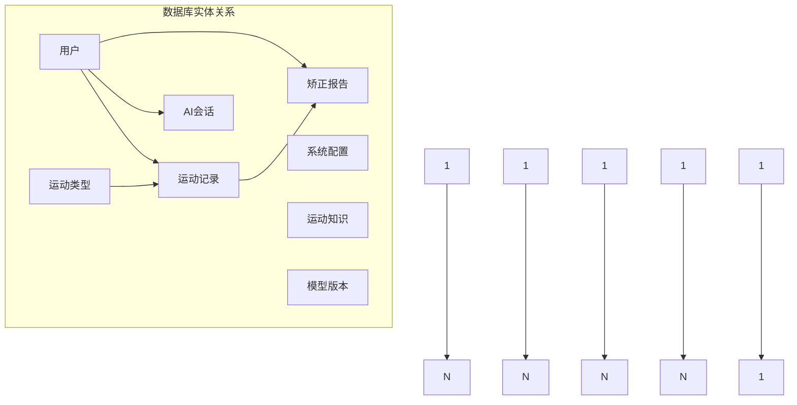

# 4. 系统设计

本章主要阐述运动动作矫正系统的整体设计方案，包括系统架构设计和数据库设计两大部分。系统架构设计从宏观层面描述系统的层次结构、模块划分和数据流向；数据库设计从数据层面描述数据的组织方式和存储结构，为系统的具体实现提供设计蓝图。

## 4.1 系统功能概述

系统功能概述是对运动动作矫正系统整体功能的宏观描述。本系统采用前后端分离架构，结合云端协同计算，实现智能健身辅助功能。

### 4.1.1 核心功能模块

系统核心功能模块：

1. **姿态识别与动作检测**：基于MediaPipe Pose算法实现人体姿态实时检测，识别健身动作并判断规范性。
2. **动作矫正与反馈**：实时提供矫正建议，包括错误识别、方案生成和数据记录。
3. **健身知识科普**：提供标准姿势、常见错误及纠正方法等科普内容。
4. **用户管理与数据统计**：实现用户登录、信息管理和运动数据统计。
5. **AI智能指导**：通过DeepSeek API提供智能化健身指导服务。

### 4.1.2 系统工作流程

系统典型工作流程：

### 4.1.3 系统架构支持

系统采用前后端分离架构：
- **前端表现层**：微信小程序端和后台管理端
- **后端服务层**：Web服务器、姿态识别算法和AI服务模块
- **数据存储层**：MySQL数据库

这种架构实现了功能模块化和服务可扩展性，为用户提供流畅的健身指导体验。

## 4.2 数据库设计

数据库设计是系统设计的重要组成部分，合理的数据库设计能够提高数据存储效率和查询性能。本节从概念结构设计、逻辑结构设计和物理结构设计三个层次对数据库进行详细设计。

### 4.2.1 概念结构设计

概念结构设计采用实体-联系方法，通过绘制实体关系图描述系统中的数据实体及其相互关系。根据需求分析，本系统涉及的主要数据实体包括用户、运动类型、运动记录、系统配置、AI会话、运动知识、模型版本和矫正报告。

用户实体存储系统用户的基本信息，主要属性包括用户标识、用户名、密码哈希、微信开放标识、头像、手机号、性别、年龄、身高、体重、昵称、角色、状态等。用户实体与运动记录实体之间存在一对多的关系，一个用户可以有多条运动记录；用户实体与AI会话实体之间存在一对多的关系，一个用户可以有多条AI会话记录；用户实体与矫正报告实体之间存在一对多的关系，一个用户可以有多份矫正报告。

运动类型实体存储系统支持的运动项目信息，主要属性包括类型标识、运动名称、运动代码、状态等。运动类型实体与运动记录实体之间存在一对多的关系，一种运动类型对应多条运动记录。通过独立的运动类型表设计，系统可以灵活扩展支持更多运动项目。

运动记录实体存储用户的健身运动数据，主要属性包括记录标识、用户标识、运动类型标识、运动时长、正确次数、错误次数、详细数据等。运动记录实体与矫正报告实体之间存在一对一的关系，每条运动记录可生成一份矫正报告。运动记录实体中的详细数据字段采用JSON格式存储，可保存骨架点坐标、关节角度等结构化数据。

系统配置实体存储系统的配置参数，主要属性包括配置标识、配置键名、配置值、描述等。系统配置实体相对独立，用于存储姿态识别算法阈值、系统运行参数等配置信息。

AI会话实体存储用户与AI服务的对话记录，主要属性包括会话标识、用户标识、会话编号、消息数量等。AI会话实体用于支持用户与DeepSeek AI服务的交互功能，记录用户的健身咨询历史。

运动知识实体存储健身知识科普内容，主要属性包括知识标识、标题、分类、内容、状态等。运动知识实体相对独立，用于支持系统的健身知识科普功能。

模型版本实体存储姿态识别模型的版本信息，主要属性包括版本标识、模型代码、模型名称、版本标签、准确率、延迟等。模型版本实体用于记录算法模型的迭代历史，支持模型的版本管理和性能追踪。

矫正报告实体存储用户运动的分析报告，主要属性包括报告标识、用户标识、运动记录标识、总结文本、错误分布数据等。矫正报告实体与运动记录实体相关联，为用户提供详细的动作分析结果。

### 4.2.2 逻辑结构设计

逻辑结构设计将概念模型转换为关系模型，定义数据库表结构。本系统采用MySQL关系型数据库，数据库表命名采用小写下划线风格，主键统一命名为id，时间字段统一命名为created_at和updated_at，所有表均包含逻辑删除标记is_deleted。数据库表结构设计如下。

```mermaid
graph TD
    A[数据表结构] --> B[sys_user 用户表]
    A --> C[sport_type 运动类型表]
    A --> D[sport_record 运动记录表]
    A --> E[sys_config 系统配置表]
    A --> F[ai_chat_session AI会话表]
    A --> G[knowledge_article 运动知识表]
    A --> H[model_version 模型版本表]
    A --> I[correction_report 矫正报告表]
    
    B --> B1[BIGINT id]
    B --> B2[VARCHAR username]
    B --> B3[VARCHAR password_hash]
    B --> B4[VARCHAR openid]
    B --> B5[VARCHAR avatar_url]
    B --> B6[VARCHAR phone]
    B --> B7[TINYINT gender]
    B --> B8[INT age]
    B --> B9[FLOAT height]
    B --> B10[FLOAT weight]
    B --> B11[VARCHAR nick_name]
    B --> B12[VARCHAR role]
    B --> B13[VARCHAR status]
    B --> B14[DATETIME created_at]
    B --> B15[DATETIME updated_at]
    B --> B16[TINYINT is_deleted]
    
    C --> C1[BIGINT id]
    C --> C2[VARCHAR name]
    C --> C3[VARCHAR code]
    C --> C4[VARCHAR status]
    C --> C5[DATETIME created_at]
    C --> C6[DATETIME updated_at]
    C --> C7[TINYINT is_deleted]
    
    D --> D1[BIGINT id]
    D --> D2[BIGINT user_id]
    D --> D3[BIGINT sport_type_id]
    D --> D4[INT duration]
    D --> D5[INT correct_count]
    D --> D6[INT incorrect_count]
    D --> D7[JSON detail_json]
    D --> D8[DATETIME created_at]
    D --> D9[DATETIME updated_at]
    D --> D10[TINYINT is_deleted]
    
    subgraph 数据表结构设计
    A
    B
    C
    D
    E
    F
    G
    H
    I
    end
```

用户表（sys_user）用于存储用户基本信息，表结构设计如下：id字段为BIGINT类型，主键，自增，作为用户的唯一标识；username字段为VARCHAR(50)类型，存储用户名；password_hash字段为VARCHAR(255)类型，存储密码哈希值；openid字段为VARCHAR(64)类型，存储微信开放标识，用于微信登录授权；unionid字段为VARCHAR(64)类型，存储微信统一标识；avatar_url字段为VARCHAR(255)类型，存储头像URL；phone字段为VARCHAR(20)类型，存储手机号；gender字段为TINYINT类型，存储性别，0表示未知，1表示男，2表示女；age字段为INT类型，存储年龄；height字段为FLOAT类型，存储身高，单位厘米；weight字段为FLOAT类型，存储体重，单位千克；nick_name字段为VARCHAR(64)类型，存储昵称；role字段为VARCHAR(20)类型，存储角色，包括super、admin、user三种角色；status字段为VARCHAR(20)类型，存储状态，包括active、inactive两种状态；created_at字段为DATETIME类型，存储创建时间；updated_at字段为DATETIME类型，存储更新时间；is_deleted字段为TINYINT类型，存储逻辑删除标记。用户表在username字段和openid字段上建立唯一索引，在phone字段上建立普通索引。

运动类型表（sport_type）用于存储系统支持的运动项目信息，表结构设计如下：id字段为BIGINT类型，主键，自增；name字段为VARCHAR(50)类型，存储运动名称；code字段为VARCHAR(50)类型，存储运动代码，如push_up、sit_up等；status字段为VARCHAR(20)类型，存储状态；created_at字段为DATETIME类型，存储创建时间；updated_at字段为DATETIME类型，存储更新时间；is_deleted字段为TINYINT类型，存储逻辑删除标记。运动类型表在code字段上建立唯一索引，确保运动代码的唯一性。

运动记录表（sport_record）用于存储用户的健身运动数据，表结构设计如下：id字段为BIGINT类型，主键，自增；user_id字段为BIGINT类型，外键，关联用户表的主键；sport_type_id字段为BIGINT类型，外键，关联运动类型表的主键；duration字段为INT类型，存储运动时长，单位秒；correct_count字段为INT类型，存储正确次数；incorrect_count字段为INT类型，存储错误次数；detail_json字段为JSON类型，存储详细数据，包括骨架点坐标、关节角度等结构化信息；created_at字段为DATETIME类型，存储创建时间；updated_at字段为DATETIME类型，存储更新时间；is_deleted字段为TINYINT类型，存储逻辑删除标记。运动记录表在user_id字段、sport_type_id字段和created_at字段上建立普通索引，提高查询效率。

系统配置表（sys_config）用于存储系统的配置参数，表结构设计如下：id字段为BIGINT类型，主键，自增；config_key字段为VARCHAR(50)类型，存储配置键名；config_value字段为TEXT类型，存储配置值；description字段为VARCHAR(255)类型，存储配置描述；created_at字段为DATETIME类型，存储创建时间；updated_at字段为DATETIME类型，存储更新时间；is_deleted字段为TINYINT类型，存储逻辑删除标记。系统配置表在config_key字段上建立唯一索引，确保配置键名的唯一性。

AI会话表（ai_chat_session）用于存储用户与AI服务的对话记录，表结构设计如下：id字段为BIGINT类型，主键，自增；user_id字段为BIGINT类型，外键，关联用户表的主键；session_id字段为VARCHAR(64)类型，存储会话标识；message_count字段为INT类型，存储消息数量；created_at字段为DATETIME类型，存储创建时间；updated_at字段为DATETIME类型，存储更新时间；is_deleted字段为TINYINT类型，存储逻辑删除标记。AI会话表在user_id字段上建立普通索引，便于查询用户的会话记录。

运动知识表（knowledge_article）用于存储健身知识科普内容，表结构设计如下：id字段为BIGINT类型，主键，自增；title字段为VARCHAR(128)类型，存储文章标题；category字段为VARCHAR(64)类型，存储文章分类；content字段为TEXT类型，存储文章内容；status字段为TINYINT类型，存储发布状态；created_at字段为DATETIME类型，存储创建时间；updated_at字段为DATETIME类型，存储更新时间；is_deleted字段为TINYINT类型，存储逻辑删除标记。运动知识表在category字段上建立普通索引，便于按分类查询文章。

模型版本表（model_version）用于存储姿态识别模型的版本信息，表结构设计如下：id字段为BIGINT类型，主键，自增；model_code字段为VARCHAR(64)类型，存储模型代码；model_name字段为VARCHAR(64)类型，存储模型名称；version_tag字段为VARCHAR(32)类型，存储版本标签；accuracy_rate字段为DECIMAL(5,2)类型，存储模型准确率；latency_ms字段为INT类型，存储模型延迟，单位毫秒；created_at字段为DATETIME类型，存储创建时间；updated_at字段为DATETIME类型，存储更新时间；is_deleted字段为TINYINT类型，存储逻辑删除标记。模型版本表在model_code字段上建立唯一索引，确保模型代码的唯一性。

矫正报告表（correction_report）用于存储用户运动的分析报告，表结构设计如下：id字段为BIGINT类型，主键，自增；user_id字段为BIGINT类型，外键，关联用户表的主键；sport_record_id字段为BIGINT类型，外键，关联运动记录表的主键；summary_text字段为VARCHAR(512)类型，存储总结文本；error_distribution_json字段为TEXT类型，存储错误分布数据；created_at字段为DATETIME类型，存储创建时间；updated_at字段为DATETIME类型，存储更新时间；is_deleted字段为TINYINT类型，存储逻辑删除标记。矫正报告表在user_id字段和sport_record_id字段上建立普通索引，便于查询用户的矫正报告。

### 4.2.3 物理结构设计

物理结构设计考虑数据在存储介质上的组织方式，主要包括索引设计和存储优化两个方面。

在索引设计方面，为提高查询效率，在频繁查询的字段上建立索引。用户表的username字段用于用户名登录查询，openid字段用于微信登录查询，均建立唯一索引；phone字段用于手机号查询，建立普通索引。运动类型表的code字段用于运动代码查询，建立唯一索引。运动记录表的user_id字段用于查询用户的运动记录，sport_type_id字段用于按运动类型查询，created_at字段用于按时间排序查询，均建立普通索引。系统配置表的config_key字段用于配置查询，建立唯一索引。AI会话表的user_id字段用于查询用户的会话记录，建立普通索引。运动知识表的category字段用于按分类查询，建立普通索引。模型版本表的model_code字段用于模型代码查询，建立唯一索引。矫正报告表的user_id字段和sport_record_id字段用于关联查询，均建立普通索引。

在存储优化方面，采用以下策略提高数据库性能。对于文本内容较长的字段如运动知识表的内容字段、系统配置表的配置值字段，采用TEXT类型存储，避免占用过多主表空间。对于结构化数据如运动记录表的详细数据字段、矫正报告表的错误分布字段，采用JSON类型存储，便于数据的灵活存储和解析。对于频繁更新的数据如运动记录，考虑按时间分表存储，提高查询效率。数据库连接采用连接池管理，避免频繁创建和销毁连接带来的性能开销。所有表均采用逻辑删除机制，通过is_deleted字段标记删除状态，保留历史数据便于数据恢复和审计追溯。

## 4.3 本章小结

本章对运动动作矫正系统进行了详细的系统设计。在系统架构部分，阐述了系统的整体架构设计，将系统划分为前端表现层、后端服务层和数据存储层三个层次；详细设计了前端架构，包括微信小程序端和后台管理端的结构组织；详细设计了后端架构，包括Web服务模块、姿态识别模块、AI服务模块和数据访问模块；设计了数据通信架构，明确了WebSocket实时通信和RESTful API通信两种方式。在数据库设计部分，进行了概念结构设计，识别了用户、运动类型、运动记录、系统配置、AI会话、运动知识、模型版本、矫正报告八个核心实体及其关联关系；进行了逻辑结构设计，定义了八张数据库表的详细字段结构，采用统一的命名规范和逻辑删除机制；进行了物理结构设计，制定了完善的索引策略和存储优化方案。本章的设计工作为系统的具体实现提供了明确的指导。